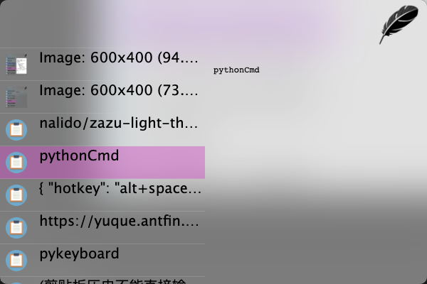
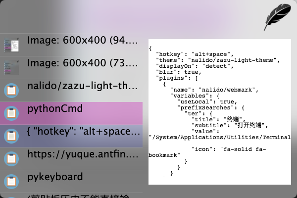

## Light Theme

A light theme example written in SASS with node/gulp.

[View a demo](https://tinytacoteam.github.io/zazu-theme-playbook/#tinytacoteam/zazu-light-theme)

预览样式

鼠标hover样式

## Installing

Mark `nalido/zazu-light-theme` inside of your `~/.zazurc.json` file.

~~~ json
{
  "theme": "nalido/zazu-light-theme"
}
~~~

## Building

~~~
npm install
npm run build
~~~
